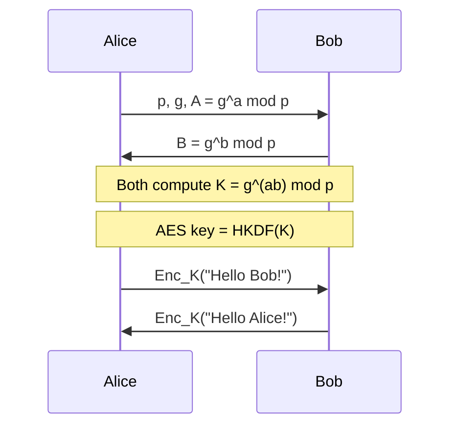

# IMPLEMENTATION PLAN — IS FA2: "Secure Chat: Break It, Then Fix It"

> **Reading guide:**
> - `VERIFIED` = read directly from repo source.
> - `ASSUMED` = reasonable inference; must be confirmed by the team.
> - ✅ **DONE** = already completed and tested.
> - 🔲 **TODO** = not yet started.
> - ⚠️ = needs team decision or confirmation.
>
> Original repo: `jaybosamiya/DiffieHellman-ManInTheMiddle` (MIT, archived 2018).
> Our fork target: Python 3.13, Windows + Linux compatible.

---

## PART 1 — FINDINGS SUMMARY (Step A)

### 1.1 Python Version and Breaking Constructs

**VERIFIED:** The original files were Python 2. Every file uses `print` as a statement,
`Tkinter` (capital T), and PyCrypto-specific APIs. Python system on this machine is 3.13.7.

| File | Line(s) | Python 2 construct | Python 3 impact |
|---|---|---|---|
| `run.py` | 12-14, 34, 47, 57 | `print "..."` bare statements | `SyntaxError` |
| `diffie_hellman.py` | 33-35, 47-48 | `print '...'` bare statements | `SyntaxError` |
| `diffie_hellman.py` | 18, 22 | `randint(p/2, p-1)` — `/` returns float | `TypeError` in `randint` (needs `int`) |
| `diffie_hellman.py` | 4, 9 | `from Crypto.PublicKey import RSA; RSAKey.key.p` | PyCrypto is dead; pycryptodome API is `RSAKey.p` |
| `crypto_protocol.py` | 14, 57, 73 | `len(data) / 16` — float division | Wrong block counts; `range(float)` → `TypeError` |
| `crypto_protocol.py` | 9 | `''.join(chr(randint(0,255))...)` | `chr()` on int works in Py3, but result is `str` not `bytes` |
| `crypto_protocol.py` | 25, 31 | `ord(data[-1])`, `ord(data[i])` | `bytes[i]` is already `int` in Py3; `ord(int)` → `TypeError` |
| `crypto_protocol.py` | 52 | `chr(ord(A[i]) ^ ord(B[i]))` | Same `ord(int)` crash |
| `crypto_protocol.py` | 58, 64, 74, 79 | `encrypted_data += encrypted_block` (`str += str`) | Must be `bytes += bytes` |
| `crypto_protocol.py` | 90 | `h.update(str(key))` | `update()` requires `bytes` in Py3 |
| `crypto_protocol.py` | 91 | `a2b_hex(h.hexdigest())` | Works but `h.hexdigest()` is `str`; `a2b_hex` needs `bytes` |
| `crypto_protocol.py` | 71 | `print "Invalid size..."` | `SyntaxError` |
| `gui.py` | 3 | `import Tkinter` (capital T) | `ModuleNotFoundError`; Py3 name is `tkinter` |
| `gui.py` | 18 | `print "Sender callback..."` | `SyntaxError` |
| `mitm.py` | 15-16, 43, 49 | `print "..."` bare statements | `SyntaxError` |
| `network.py` | 3 | `import pwn` (pwntools) | Works on Linux; **unreliable on Windows** |
| `network.py` | 22 | `.decode('base64')` — Python 2 codec | `LookupError: unknown encoding: base64` in Py3 |
| `network.py` | 27-28 | `.encode('base64').replace('\n','') + '\n'` | Same codec error; `str + str` vs `bytes + bytes` |

### 1.2 Third-Party Dependencies (VERIFIED from imports)

| Import | File(s) | Library needed | Status |
|---|---|---|---|
| `from Crypto.PublicKey import RSA` | `diffie_hellman.py:4` | `pycryptodome` | ✅ installed (3.23.0) |
| `from Crypto.Cipher import AES` | `crypto_protocol.py:13` | `pycryptodome` | ✅ installed |
| `from Crypto.Hash import SHA256` | `crypto_protocol.py:97` (inside `__init__`) | `pycryptodome` | ✅ installed |
| `import pwn` | `network.py:3` (ORIGINAL) | `pwntools` | ✅ REMOVED — replaced with stdlib `socket` |
| `import tkinter` | `gui.py:4` (our port) | stdlib | ✅ stdlib (Python 3.13) |
| `import socket`, `import base64` | `network.py:4-5` (our port) | stdlib | ✅ stdlib |

**Dependencies needed for future phases (not yet installed):**
- `cryptography` — RSA-PSS/SHA-512 signatures, AES-GCM (Phase 3)
- `pyotp` — TOTP generation (Phase 5)
- `qrcode` — QR PNG enrollment (Phase 5)
- `Pillow` — required by qrcode for PNG output (Phase 5)

### 1.3 Launch Commands (VERIFIED vs README)

**VERIFIED from `run.py:31-58` and `mitm.py:30-32`:**

| Role | Correct command | README says | Mismatch? |
|---|---|---|---|
| Server | `python run.py <port>` | `python run.py port_number` | ✅ matches |
| Client | `python run.py <ip> <port>` | `python run.py ip_address port_number` | ✅ matches |
| MITM | `python mitm.py <server_ip> <port_1> <port_2>` | `python server_ip_address port_number_1 port_number_2` (script name omitted!) | ⚠️ README omits `mitm.py` — confirmed from `mitm.py:15-17` |

**VERIFIED startup order:** MITM must be started AFTER the server binds (MITM calls
`conn_server.connect()` at startup, before waiting for any client). The client must be
started AFTER MITM is ready. So order is always: **Server → MITM → Client**.

### 1.4 DH Parameter Generation and Transmission

**VERIFIED from `diffie_hellman.py`:**

| Item | How | Security note |
|---|---|---|
| Prime `p` | `RSA.generate(2048).p` — extracts the prime factor of a 2048-bit RSA key. Result is ≈1024-bit prime. | ✅ 1024-bit prime is weak by 2024 standards; NIST recommends ≥2048-bit DH group. |
| Generator `g` | `randint(p//2, p-1)` — a random large integer. | ⚠️ **Not a primitive root modulo p.** The chosen `g` may only generate a small subgroup. Cryptographically problematic; acceptable only as a learning demo. |
| Private exponent | `randint(p//2, p-1)` — same distribution as `g`. | ✅ Large enough to resist brute force at this prime size. |
| Public value | `pow(g, private_exponent, p)` — standard modular exponentiation. | ✅ Correct formula. |

**Wire protocol (VERIFIED from `run.py:38-54`):**
```
Server → Client:  str(p)   [one newline-terminated base64 line]
Server → Client:  str(g)   [one newline-terminated base64 line]
Server → Client:  str(A)   [one newline-terminated base64 line]
Client → Server:  str(B)   [one newline-terminated base64 line]
```
Numbers are sent as decimal strings, then base64-encoded by `network.py`.

**Receiver validation: NONE.** VERIFIED: the client does `p = int(get_line())` with
no checks on primality, generator validity, or value ranges. This is exactly what
"parameter injection" exploits.

**Parameter injection** (VERIFIED from `mitm.py:54-74`):
Mallory intercepts `p, g, A` from the server. She creates her own `DiffieHellman(p, g)`,
computes `B_server` (her own public value), and sends **that** to the server in place of
the client's real B. She simultaneously creates a second `DiffieHellman(p, g)`, computes
`A_client` (another forged value), and sends `p, g, A_client` to the client in place of
the server's real A. Result: two independent shared secrets, one per side, both known
only to Mallory.

### 1.5 Key Derivation and Cipher (VERIFIED from `crypto_protocol.py`)

**Key derivation:**
```
shared_secret (int)  →  str(shared_secret).encode('utf-8')
                     →  SHA-256 hex digest (64 hex chars = 32 bytes)
                     →  bytes.fromhex(...)   →  32 bytes
                     →  first 16 bytes = AES key
                     →  last  16 bytes = IV
```

**Cipher:** AES-128-CBC (hand-rolled from AES-128-ECB as a black box).

**Weaknesses:**
1. **AES-128, not AES-256.** Key is first 16 bytes of SHA-256 output (128 bits). Acceptable but not modern best practice.
2. **Fixed IV.** IV is derived from the shared secret and is the same for every message in a session. CBC with fixed IV leaks information about messages that share a common prefix.
3. **No authentication tag.** AES-CBC provides no integrity check. An active attacker can flip bits in ciphertext and cause predictable plaintext changes (CBC bit-flip attack). There is no MAC or HMAC.
4. **Key derivation is `str(int)`.** Converting the integer to a decimal string before hashing is non-standard and wasteful; HKDF from the raw integer bytes is the modern approach.
5. **Custom CBC implementation.** Manually reimplementing CBC around ECB is fragile and easy to get wrong (as evidenced by the Python 2→3 porting bugs in the original).
6. **PKCS#7 padding oracle potential.** A custom unpad function that raises a specific `PaddingException` can enable padding oracle attacks in some network scenarios.

### 1.6 Message Framing and Wire Protocol (VERIFIED from `network.py`)

```
Wire format per message:
  base64_encode(payload_bytes) + b'\n'

Payload for handshake:    UTF-8 bytes of decimal integer string
Payload for chat:         hex string of raw AES-CBC ciphertext
                          (hex string then UTF-8 encoded, then base64 encoded)

Receiver reads byte-by-byte until '\n', strips, base64-decodes, UTF-8 decodes.
```

Note: the "double encoding" (hex → UTF-8 → base64) is our Phase 0 compatibility
choice. The original Python 2 code encoded raw binary directly as base64. Both work;
the hex layer is explicit and easy to debug.

### 1.7 What `mitm.py` Does (Step by Step, VERIFIED)

```
mitm.py server_ip server_port client_port

Step 1: conn_client.listen(client_port)        — bind to client_port, wait for Alice
Step 2: conn_server.connect(server_ip, server_port)  — connect to real Bob
Step 3: recv p, g, A from Bob (3 lines)        — learn server's DH broadcast
Step 4: Create dh_server = DiffieHellman(p, g)  — Mallory's DH toward Bob
        Compute B_server = Mallory's public value
Step 5: Send str(B_server) to Bob              — Bob thinks this is Alice's B
        Bob now computes K1 = g^(b · mallory_s) mod p
Step 6: p_client = p_server, g_client = g_server  — reuse same params
Step 7: Create dh_client = DiffieHellman(p, g)  — Mallory's DH toward Alice
        Compute A_client = Mallory's public value
Step 8: Send str(p), str(g), str(A_client) to Alice — Alice gets FORGED A
        Alice computes K2 = g^(a · mallory_c) mod p
Step 9: Recv str(B_client) from Alice          — Alice's real public value
        Compute K2 fully. Mallory now holds K1 (with Bob) and K2 (with Alice).

Relay loop (two threads):
  Thread 1: recv from server → cp_server.decrypt() → display in MITM GUI
            → cp_client.encrypt() → send to client
  Thread 2: recv from client → cp_client.decrypt() → display in MITM GUI
            → cp_server.encrypt() → send to server
```

Alice and Bob see no difference. Only Mallory's GUI window shows plaintext of every message.

### 1.8 Is the GUI Needed for the Demo?

**VERIFIED:** Both `run.py` and `mitm.py` unconditionally start a `GUIThread` and
later call `gui.add_new_text()` in the receive loop. Removing the GUI requires
either commenting out these calls or adding a `--no-gui` flag.

**Recommendation:** Keep the GUI for the live demo (it's visually compelling). Add a
`--no-gui` flag in Phase 1 for automated testing. The two headless test scripts
already bypass the GUI entirely.

---

## PART 2 — DECISIONS AND ASSUMPTIONS

| # | Question / Decision | Our Default | Rationale |
|---|---|---|---|
| D1 | Python target version | **3.13** (system version) | Already on the machine; venv active |
| D2 | Keep GUI or drop it? | **Keep GUI + add `--no-gui`** | Demo impact; automated tests use headless scripts |
| D3 | DH group: toy vs RFC 3526 2048-bit? | **RFC 3526 2048-bit MODP in `--secure` mode; keep toy in vulnerable mode** | Toy for explanation, real for security claim |
| D4 | `--toy-params` flag? | **Yes**, but only in Phase 2 commit | Lets the first demo minute use small numbers |
| D5 | RSA vs ECDSA for signatures? | **RSA-PSS / SHA-512** | Matches IS syllabus Unit IV explicitly; `cryptography` library |
| D6 | Key bit size? | **RSA-2048** | Standard; fast enough on lab machines |
| D7 | How are public keys pre-shared? | **Files on disk (`alice_pub.pem`, `bob_pub.pem`), generated by `gen_keys.py` before demo** | Simplest for a local lab demo; explain in viva that real-world uses certificates/PKI |
| D8 | Symmetric cipher after Phase 2 | **AES-256-GCM via `cryptography` library** | Authenticated encryption; eliminates bit-flip + padding oracle risks |
| D9 | Key derivation after Phase 2 | **SHA-256 of DH secret bytes** (simple) or **HKDF-SHA-256** (better) | Use HKDF; one-line extra, looks professional, maps to Unit IV |
| D10 | MFA scope | **TOTP only (RFC 6238)** | `pyotp` is trivial; scope is bounded; maps to Unit IV |
| D11 | MFA storage | **JSON file per user (`users.json`)** | Local lab; no database needed |
| D12 | Lockout policy | **3 failed TOTP attempts → 30-second cooldown** | Simple, demonstrable |
| D13 | AVISPA installation | **Try local install first; web interface fallback** | Web at `https://avispa-project.org/` exists; document both |
| D14 | `venv` name | `venv/` in repo root | Already created |
| D15 | `.pem` files in `.gitignore`? | **Yes — add `*.pem` and `users.json`** | Security hygiene; never commit keys |

**Open questions for the team:**
1. ⚠️ Exact deadline and deliverable format (confirm with faculty).
2. ⚠️ Group size (plan assumes 4 members).
3. ⚠️ Does the faculty want the demo run from the same machine (localhost) or across two lab PCs?
4. ⚠️ Is AVISPA pre-installed on lab machines, or must we use the web interface?
5. ⚠️ Is the report in English, and how long (the context says 6–10 pages)?

---

## PART 3 — PHASED PLAN

---

### ✅ PHASE 0: Python 3 Port + Baseline (ALREADY DONE)

**Goal:** Get the existing codebase running on Python 3 with zero new features.

**Status: COMPLETED AND TESTED on 2026-09-30.**

#### What Was Changed

| File | Change | Why |
|---|---|---|
| `network.py` | Removed `import pwn`; replaced `pwn.listen/remote` with stdlib `socket.socket`; replaced Python 2 `'base64'` codec with `import base64; base64.b64encode/decode()` | pwntools unreliable on Windows; stdlib socket is portable and zero-dependency |
| `diffie_hellman.py` | `print "..."` → `print(...)` × 6; `p/2` → `p//2` × 2; `RSAKey.key.p` → `RSAKey.p` | Py3 syntax; float division crash; pycryptodome API change |
| `crypto_protocol.py` | `print "..."` → `print(...)` × 1; `''.join(chr(...))` → `bytes(...)`; `ord(data[i])` removed (bytes-index gives int); all `str` accumulators → `bytes`; `/` → `//` × 3; `h.update(str(key))` → `h.update(str(key).encode('utf-8'))`; `a2b_hex(h.hexdigest())` → `bytes.fromhex(h.hexdigest())`; `encrypt()` returns `.hex()` string; `decrypt()` accepts hex string via `bytes.fromhex()` | Comprehensive bytes/str fix; makes network layer simple (everything UTF-8 text) |
| `gui.py` | `import Tkinter` → `import tkinter as Tkinter`; `print "..."` → `print(...)` × 1 | Module renamed in Py3 |
| `run.py` | `print "..."` → `print(...)` × 4 | Py3 syntax only |
| `mitm.py` | `print "..."` → `print(...)` × 3 | Py3 syntax only |

#### New Files Added in Phase 0

| File | Purpose |
|---|---|
| `requirements.txt` | Pins `pycryptodome==3.23.0`; install with `venv\Scripts\pip install -r requirements.txt` |
| `venv/` | Python 3.13 virtual environment (not committed to git) |
| `headless_test.py` | Integration test: two threads, full DH handshake + 3-message echo, no GUI |
| `headless_mitm_test.py` | MITM integration test: three threads, parameter injection, proves Mallory reads plaintext |

#### Test Results (VERIFIED, run on this machine)

```
$ venv\Scripts\python diffie_hellman.py
[+] DH self-test passed          ← 1024-bit prime generated, sA == sB asserted

$ venv\Scripts\python crypto_protocol.py
[+] CBC decrypt(encrypt(text))==text test passed

$ venv\Scripts\python headless_test.py
[+] Server received:  Hello from client! / Secret message 42 / Python 3 works!
[+] Client received echoes: ECHO:Hello from client! / ECHO:Secret message 42 / ECHO:Python 3 works!
[PASS] All messages round-tripped correctly.

$ venv\Scripts\python headless_mitm_test.py
[MITM] Intercepted: Attack at dawn
[MITM] Intercepted: Bank PIN is 1234
[MITM] Intercepted: Top secret data
[+] MITM captured 3/3 messages in plaintext
[+] Server ultimately received all 3 messages
[PASS] MITM attack succeeded — unauthenticated DH is broken.
```

#### Manual GUI Verification (requires 3 separate terminals)

```powershell
# Activate venv in every terminal first:
cd c:\Users\ASUS\Desktop\Harsh\PROJECTS\IS_FA2\DiffieHellman_V2
venv\Scripts\activate

# Terminal 1 — Server
python run.py 9000

# Terminal 2 — Client (after server window appears)
python run.py 127.0.0.1 9000

# Terminal 3 (MITM scenario) — after restarting server:
python mitm.py 127.0.0.1 9000 9001
# Terminal 4 (client connects to MITM):
python run.py 127.0.0.1 9001
```

#### Go / No-Go Criterion

✅ **GO** — all four automated tests pass. The fallback (rewrite ~150-line version from scratch)
is **not needed**.

#### Suggested Commit

```
git add network.py diffie_hellman.py crypto_protocol.py gui.py run.py mitm.py
git add requirements.txt headless_test.py headless_mitm_test.py
git commit -m "phase-0: port to Python 3 (print, bytes/str, socket, pycryptodome)"
git push origin feat/py3-port
```

---

### 🔲 PHASE 1: `--secure` Flag Plumbing + Mode Banner

**Goal:** Add `--secure` argument to `run.py` and `mitm.py`. Both modes use identical
networking; `--secure` is currently a no-op (just prints a banner). This sets up the
switch point for Phase 3 without changing any crypto yet.

**Branch:** `feat/secure-flag`

#### Files to Create/Modify

| File | Action |
|---|---|
| `run.py` | Modify: add `argparse`; parse `--secure` and `--no-gui`; print mode banner |
| `mitm.py` | Modify: add `argparse`; parse `--secure` (will warn that attack is blocked in this mode); print banner |

#### Function-Level Changes

**`run.py`:**
```python
# ADD at top (after imports):
import argparse

# ADD function:
def parse_args():
    """Parse CLI arguments. Returns Namespace with .port, .ip (client only), .secure, .no_gui."""
    parser = argparse.ArgumentParser(description='DH Secure Chat')
    parser.add_argument('args', nargs='+', help='port | ip port')
    parser.add_argument('--secure', action='store_true',
                        help='Enable RSA-signed DH (Phase 3+)')
    parser.add_argument('--no-gui', action='store_true',
                        help='CLI mode (for automated tests)')
    return parser.parse_args()

# REPLACE the bare sys.argv length check with parse_args() call.
# REPLACE GUIThread launch with:
#   if not args.no_gui: GUIThread().start()
# REPLACE gui.add_new_text() call with:
#   if not args.no_gui: gui.add_new_text(...) else: print(...)
```

**`mitm.py`:**
```python
# ADD at top:
import argparse

def parse_args():
    """Returns Namespace with .server_ip, .server_port, .client_port, .secure, .no_gui."""
    parser = argparse.ArgumentParser(description='DH MITM Proxy')
    parser.add_argument('server_ip')
    parser.add_argument('server_port', type=int)
    parser.add_argument('client_port', type=int)
    parser.add_argument('--secure', action='store_true')
    parser.add_argument('--no-gui', action='store_true')
    return parser.parse_args()
```

**Banner function (add to both, or extract to a shared `utils.py`):**
```python
def print_banner(role: str, secure: bool):
    mode = "SECURE (signed DH)" if secure else "VULNERABLE (unsigned DH)"
    print(f"[*] Starting as {role} in {mode} mode.")
    if not secure:
        print("[!] WARNING: DH values are unauthenticated — MITM attack possible.")
```

#### Step-by-Step Tasks

1. Add `import argparse` to `run.py` and `mitm.py`.
2. Write `parse_args()` in each file; replace `sys.argv` length checks.
3. Add `print_banner()` call immediately after args are parsed.
4. Guard GUI calls with `if not args.no_gui`.
5. In `mitm.py`, if `args.secure`: print `"[MITM] Running in secure mode — will attempt attack (expect it to fail in Phase 4)"`.

#### Verification

```bash
python run.py 9000 --secure
# Expected: "[*] Starting as Server in SECURE (signed DH) mode."

python run.py 9000
# Expected: "[*] Starting as Server in VULNERABLE (unsigned DH) mode."
#           "[!] WARNING: DH values are unauthenticated — MITM attack possible."

python run.py 9000 --no-gui
# Expected: banner printed; no Tkinter window opens; process blocks on conn.listen()
```

#### Automated Tests

Add `tests/test_args.py`:
```python
# Verify that parse_args() returns correct Namespace for various argv combinations.
# Use unittest.mock.patch('sys.argv', [...]) to simulate CLI.
```

#### Commit Message

```
git commit -m "phase-1: argparse --secure and --no-gui flags; mode banner; no crypto change"
```

---

### 🔲 PHASE 2: Crypto Modernization (AES-256-GCM + HKDF + 2048-bit MODP)

**Goal:** Replace AES-128-CBC (hand-rolled) with AES-256-GCM (authenticated encryption)
and replace ad-hoc SHA-256 key derivation with HKDF. Upgrade DH parameters to RFC 3526
2048-bit MODP group. The protocol remains **MITM-vulnerable** after this phase (no
signatures yet). This phase is purely a crypto quality upgrade.

**Why:** AES-GCM provides both confidentiality AND integrity. HKDF is the standard KDF.
2048-bit is the NIST-recommended minimum. These changes directly map to IS Unit III and IV topics.

**Branch:** `feat/modern-crypto`

#### Files to Create/Modify

| File | Action |
|---|---|
| `crypto_protocol.py` | Modify: replace custom CBC with AES-GCM; replace SHA-256 KDF with HKDF |
| `diffie_hellman.py` | Modify: replace random prime with RFC 3526 2048-bit MODP group; add `--toy-params` path |
| `requirements.txt` | Add `cryptography>=42.0.0` |

#### Function-Level Changes

**`diffie_hellman.py`:**
```python
# ADD: RFC 3526 2048-bit MODP group (decimal, p and g are constants)
RFC3526_P = int("FFFFFFFFFFFFFFFFC90FDAA2...", 16)  # paste full hex from RFC
RFC3526_G = 2

# MODIFY DiffieHellman.__init__(p=None, g=None, toy=False):
#   if toy:  use existing generate_prime() path (for demo explanation)
#   else:    self.p = RFC3526_P; self.g = RFC3526_G

# Private exponent: use secrets.randbelow(p) instead of randint (more secure CSPRNG)
```

**`crypto_protocol.py`:**
```python
from cryptography.hazmat.primitives.ciphers.aead import AESGCM
from cryptography.hazmat.primitives.kdf.hkdf import HKDF
from cryptography.hazmat.primitives import hashes
import os

class CryptoProtocol:
    def __init__(self, shared_secret: int):
        raw = shared_secret.to_bytes((shared_secret.bit_length() + 7) // 8, 'big')
        # HKDF-SHA-256 → 32 bytes → AES-256 key
        hkdf = HKDF(algorithm=hashes.SHA256(), length=32, salt=None, info=b'dh-chat-v2')
        self.key = hkdf.derive(raw)

    def encrypt(self, data: str) -> str:
        nonce = os.urandom(12)           # 96-bit GCM nonce; must be unique per message
        ct = AESGCM(self.key).encrypt(nonce, data.encode('utf-8'), None)
        return (nonce + ct).hex()        # nonce || ciphertext; return as hex string

    def decrypt(self, data: str) -> str:
        raw = bytes.fromhex(data)
        nonce, ct = raw[:12], raw[12:]
        pt = AESGCM(self.key).decrypt(nonce, ct, None)  # raises InvalidTag if tampered
        return pt.decode('utf-8')
```

#### Verifying MITM Vulnerability Is Still Present

After Phase 2, run `headless_mitm_test.py`. It must still print `[PASS] MITM attack succeeded`.
If it does not, stop and investigate before proceeding. This is the go/no-go for Phase 3.

#### Automated Tests

```python
# tests/test_crypto_v2.py
# 1. test_encrypt_decrypt_roundtrip(): cp.decrypt(cp.encrypt("hello")) == "hello"
# 2. test_tamper_detection(): flip one byte in ciphertext → decrypt raises InvalidTag
# 3. test_nonce_uniqueness(): two encrypts of same text → different hex output
# 4. test_key_derivation_deterministic(): same shared_secret → same key
```

#### Expected Output

```bash
python -m pytest tests/test_crypto_v2.py -v
# 4 passed in < 1s
python venv\Scripts\python headless_mitm_test.py
# [PASS] MITM attack succeeded — unauthenticated DH is broken.
```

#### Commit Message

```
git commit -m "phase-2: AES-256-GCM, HKDF-SHA-256, RFC 3526 2048-bit MODP; MITM still works"
```

---

### 🔲 PHASE 3: Signature Layer (`--secure` becomes real)

**Goal:** When `--secure` is passed, each side signs its DH public value with RSA-PSS/SHA-512
and verifies the other's signature before computing the shared secret. MITM fails because
Mallory cannot forge signatures.

**Why RSA-PSS/SHA-512:** Maps directly to IS Unit III (RSA) and Unit IV (SHA-512,
digital signatures). PSS is the modern, secure RSA padding scheme (as opposed to PKCS#1v1.5).

**Branch:** `feat/signed-dh`

#### Files to Create/Modify

| File | Action |
|---|---|
| `auth_dh.py` | **CREATE**: signature helpers (sign, verify, load/save keys) |
| `gen_keys.py` | **CREATE**: one-shot key generation script |
| `crypto_protocol.py` | **MODIFY**: add `secure_handshake_server()` and `secure_handshake_client()` |
| `run.py` | **MODIFY**: call secure handshake when `args.secure` |
| `mitm.py` | **MODIFY**: attempt attack in secure mode; catch/print verification failure |
| `.gitignore` | **MODIFY**: add `*.pem`, `users.json` |
| `requirements.txt` | Ensure `cryptography>=42.0.0` present |

#### Function-Level Changes

**`auth_dh.py` (new file):**
```python
# Signature module for DH authentication (IS Unit III: RSA; Unit IV: SHA-512)

from cryptography.hazmat.primitives.asymmetric import rsa, padding
from cryptography.hazmat.primitives import hashes, serialization
from cryptography.exceptions import InvalidSignature

_PSS = padding.PSS(mgf=padding.MGF1(hashes.SHA512()), salt_length=padding.PSS.MAX_LENGTH)

def generate_keypair(bits: int = 2048) -> tuple:
    """Generate RSA-2048 key pair. Returns (private_key, public_key)."""

def save_private_key(private_key, path: str) -> None:
    """Save private key as PEM (PKCS8, unencrypted — demo only)."""

def save_public_key(public_key, path: str) -> None:
    """Save public key as PEM (SubjectPublicKeyInfo)."""

def load_private_key(path: str):
    """Load private key from PEM file."""

def load_public_key(path: str):
    """Load public key from PEM file."""

def sign(private_key, data: bytes) -> bytes:
    """Sign data with RSA-PSS/SHA-512. Returns raw signature bytes."""

def verify(public_key, signature: bytes, data: bytes) -> bool:
    """Verify RSA-PSS/SHA-512 signature. Returns True or False (never raises)."""
```

**`gen_keys.py` (new file):**
```python
# Run once before the demo: python gen_keys.py
# Creates: alice_priv.pem, alice_pub.pem, bob_priv.pem, bob_pub.pem
from auth_dh import generate_keypair, save_private_key, save_public_key

for name in ('alice', 'bob'):
    priv, pub = generate_keypair()
    save_private_key(priv, f'{name}_priv.pem')
    save_public_key(pub, f'{name}_pub.pem')
    print(f'[+] Keys generated: {name}_priv.pem, {name}_pub.pem')
print('[!] Share only *_pub.pem with the other party. Keep *_priv.pem secret.')
```

**`crypto_protocol.py` — new functions:**
```python
def secure_handshake_server(conn, dh, own_priv_key, peer_pub_key) -> 'CryptoProtocol':
    """
    Server-side secure DH handshake:
      1. Compute A = g^a mod p
      2. Sign A_bytes with own_priv_key (RSA-PSS/SHA-512)
      3. Send A_bytes, then sig_A (two separate network messages)
      4. Recv B_bytes from client
      5. Recv sig_B from client
      6. Verify sig_B over (B_bytes + A_bytes) using peer_pub_key
         → if fails: print error and sys.exit(1)
      7. Compute shared secret; return CryptoProtocol(secret)
    Args:
      conn: network.Connection
      dh:   DiffieHellman instance (already has p, g, private exponent)
      own_priv_key: loaded RSA private key object
      peer_pub_key: loaded RSA public key object (Alice's public key)
    Returns:
      CryptoProtocol ready for message encryption
    """

def secure_handshake_client(conn, dh, own_priv_key, peer_pub_key) -> 'CryptoProtocol':
    """
    Client-side secure DH handshake:
      1. Recv A_bytes from server
      2. Recv sig_A from server
      3. Verify sig_A over A_bytes using peer_pub_key
         → if fails: print error and sys.exit(1)
      4. Compute B = g^b mod p; sign (B_bytes + A_bytes) with own_priv_key
      5. Send B_bytes, then sig_B
      6. Compute shared secret; return CryptoProtocol(secret)
    Args: same pattern as secure_handshake_server
    Returns: CryptoProtocol ready for message encryption
    """
```

**Wire message order (VERIFIED design from PROJECT_CONTEXT.md §4.2):**
```
Server → Client:  A_bytes            (DH public value as hex string)
Server → Client:  sig_A.hex()        (raw signature bytes as hex string)
Client → Server:  B_bytes            (DH public value as hex string)
Client → Server:  sig_B.hex()        (signature over B_bytes + A_bytes as hex string)
```
This binds Bob's reply to Alice's specific A value, preventing replay of an old session.

**`run.py` changes:**
```python
# In server branch (len==2), replace:
#   conn.send(str(p)); conn.send(str(g)); conn.send(str(A)); B=int(get_line())
#   crypto_protocol = CryptoProtocol(dh.get_shared_secret(B))
# With:
if args.secure:
    own_priv = load_private_key('bob_priv.pem')    # server is Bob
    peer_pub  = load_public_key('alice_pub.pem')
    crypto_protocol = secure_handshake_server(conn, dh, own_priv, peer_pub)
else:
    # original vulnerable path (unchanged)

# In client branch (len==3), replace similarly with secure_handshake_client()
# server is Bob → load alice_priv.pem, bob_pub.pem
```

**Abort message on verification failure:**
```
[SECURE] Signature verification FAILED.
[SECURE] The DH public value you received was NOT signed by the expected key.
[SECURE] Possible man-in-the-middle attack. Aborting connection.
```

**`.gitignore` additions:**
```
# Private keys — NEVER commit these
*_priv.pem
# Users database — contains hashed passwords
users.json
```
Public keys (`*_pub.pem`) are intentionally NOT ignored (they are meant to be shared).

#### Step-by-Step Tasks

1. Create `auth_dh.py` with all six functions. Unit-test each independently.
2. Create `gen_keys.py`. Run it; verify 4 PEM files appear.
3. Add `secure_handshake_server()` and `secure_handshake_client()` to `crypto_protocol.py`.
4. Modify `run.py` server branch: if `args.secure` call `secure_handshake_server`.
5. Modify `run.py` client branch: if `args.secure` call `secure_handshake_client`.
6. Update `.gitignore`. Verify `git status` does NOT show `*_priv.pem`.

#### Automated Tests

```python
# tests/test_auth_dh.py
# 1. test_sign_verify_roundtrip(): sign(priv, data) → verify(pub, sig, data) == True
# 2. test_tampered_data_fails(): verify with wrong data → False
# 3. test_wrong_key_fails(): verify with different public key → False
# 4. test_sign_returns_bytes(): sig is bytes, len > 0
# 5. test_secure_handshake_e2e(): two threads, secure handshake completes, shared key matches
```

#### Commit Message

```
git commit -m "phase-3: RSA-PSS/SHA-512 signed DH in --secure mode; auth_dh.py; gen_keys.py"
```

---

### 🔲 PHASE 4: Show the Attack Failing

**Goal:** When MITM runs against `--secure` endpoints, Alice's verification step
catches the forged DH value and aborts. Prove this with automated tests and demo output.

**Branch:** `feat/attack-demo`

#### Files to Create/Modify

| File | Action |
|---|---|
| `mitm.py` | Modify: add logging for both modes; in `--secure` mode attempt the attack anyway |
| `tests/test_secure_vs_mitm.py` | **CREATE**: end-to-end tests for all four scenarios |

#### `mitm.py` Changes

```python
# In the relay loop (session function), print every intercepted message:
print(f"[MITM][{name}] INTERCEPTED: {line}")

# When --secure is set, add at the top of the key exchange section:
if args.secure:
    print("[MITM] Secure mode detected. Attempting attack anyway...")
    print("[MITM] Note: this attack WILL be detected and aborted by the endpoints.")

# The actual attack attempt happens naturally; mitm.py does not need to change
# its logic because it cannot forge signatures. The connection simply dies when
# the client or server calls sys.exit(1) after verification failure.
```

#### Automated Tests (`tests/test_secure_vs_mitm.py`)

```python
# 1. test_vulnerable_chat_works(): no MITM, --no-secure → messages arrive
# 2. test_mitm_breaks_vulnerable(): with MITM, --no-secure → MITM reads plaintext
# 3. test_secure_chat_works(): no MITM, --secure → messages arrive (signatures pass)
# 4. test_mitm_fails_secure(): with MITM, --secure → client/server abort with clear message
# 5. test_tampered_sig_fails(): manually corrupt sig bytes → verify returns False
# 6. test_replayed_sig_fails(): use sig from session 1 in session 2 (A changes → sig invalid)
# 7. test_wrong_peer_key_fails(): load wrong pub key → verify fails
```

Each test uses `subprocess.Popen` or threads to simulate separate processes.

#### Expected Output for Test 4

```
Server:  [SECURE] Signature verification FAILED.
         [SECURE] Possible man-in-the-middle attack. Aborting connection.
Client:  [SECURE] Signature verification FAILED.
         [SECURE] Possible man-in-the-middle attack. Aborting connection.
MITM:    [MITM] Secure mode detected. Attempting attack anyway...
         [MITM] Connection closed by endpoint (signature check failed).
```

#### Commit Message

```
git commit -m "phase-4: MITM fails in --secure mode; full test suite for all 4 scenarios"
```

---

### 🔲 PHASE 5: MFA — TOTP Login

**Goal:** Add a login step (`--mfa` flag) before the DH handshake. Client must supply
a correct TOTP code (plus password). Server verifies both. Wrong code → reject. Three
wrong codes → 30-second lockout.

**Branch:** `feat/mfa`

#### Files to Create/Modify

| File | Action |
|---|---|
| `mfa.py` | **CREATE**: enrollment, login verification, lockout logic |
| `users.json` | **CREATED at runtime** by enrollment; never committed |
| `enroll.py` | **CREATE**: one-shot enrollment script (creates `users.json`, saves QR PNG) |
| `run.py` | Modify: if `--mfa`, run login flow before DH handshake |
| `requirements.txt` | Add `pyotp>=2.9.0`, `qrcode>=7.4`, `Pillow>=10.0` |

#### Function-Level Changes (`mfa.py`)

```python
import pyotp, qrcode, hashlib, hmac, os, json, time

# --- Enrollment ---
def enroll_user(username: str, password: str, users_file: str = 'users.json') -> str:
    """
    Create a user record with PBKDF2-SHA512 hashed password and TOTP secret.
    Saves to users.json. Returns QR URI for scanning.
    Args: username, password (plaintext, hashed immediately), users_file path
    Returns: TOTP provisioning URI (use qrcode to turn into PNG)
    """

def save_qr(uri: str, path: str) -> None:
    """Render URI as QR code PNG. Args: URI string, output file path."""

# --- Authentication ---
def hash_password(password: str, salt: bytes) -> bytes:
    """PBKDF2-HMAC-SHA512, 200000 iterations. Returns 64-byte digest."""

def verify_login(username: str, password: str, totp_code: str,
                 users_file: str = 'users.json') -> tuple[bool, str]:
    """
    Verify password + TOTP code. Enforces lockout after 3 failures.
    Returns (True, '') on success or (False, reason_string) on failure.
    Reason strings: 'USER_NOT_FOUND', 'WRONG_PASSWORD', 'WRONG_OTP', 'LOCKED_OUT'
    """

def _load_users(path: str) -> dict:   # internal
def _save_users(users: dict, path: str) -> None:   # internal
```

**`enroll.py` (new file):**
```python
# python enroll.py alice
# Prompts for password, creates users.json entry, saves alice_mfa_qr.png
```

**`run.py` MFA integration:**
```python
# Add --mfa flag to parse_args()
# In server branch: if args.mfa, run MFA server-side verification
#   recv username; recv password (ideally TLS-protected in real world, fine for demo)
#   recv totp_code; verify; send 'OK' or 'FAIL'; on FAIL sys.exit(1)
# In client branch: if args.mfa, prompt for username/password/totp_code; send to server
```

**Lockout implementation:**
Store `failed_attempts` and `lockout_until` (Unix timestamp) in `users.json` per user.
Reset on successful login.

#### Verification

```bash
python enroll.py alice
# → alice_mfa_qr.png created; scan with Google Authenticator / Authy

python run.py 9000 --mfa
python run.py 127.0.0.1 9000 --mfa
# Client prompts: Username: alice; Password: ****; OTP code: 123456
# With correct code: "[MFA] Login successful."
# With wrong code: "[MFA] Wrong OTP code. X attempts remaining."
# After 3 failures: "[MFA] Account locked. Try again after 30 seconds."
```

#### Automated Tests

```python
# tests/test_mfa.py
# 1. test_enroll_creates_record(): enroll_user creates users.json with correct fields
# 2. test_correct_login(): valid pw + valid TOTP → (True, '')
# 3. test_wrong_password(): wrong pw → (False, 'WRONG_PASSWORD')
# 4. test_wrong_otp(): right pw, wrong code → (False, 'WRONG_OTP')
# 5. test_lockout_after_3_fails(): 3 × wrong OTP → (False, 'LOCKED_OUT')
# 6. test_lockout_expires(): lockout_until in past → can try again
# 7. test_hash_is_deterministic(): same pw + salt → same hash
# 8. test_timing_safe(): use hmac.compare_digest (not ==) verified in source
```

#### Commit Message

```
git commit -m "phase-5: TOTP-based MFA login with PBKDF2-SHA512 and lockout; mfa.py; enroll.py"
```

---

### 🔲 PHASE 6: AVISPA Formal Verification

**Goal:** Model both protocol variants in HLPSL and run OFMC (and/or CL-AtSe) to get
UNSAFE (unauthenticated) and SAFE (authenticated) results. Screenshot outputs for slides.

**Branch:** `feat/avispa`

#### Files to Create

| File | Purpose |
|---|---|
| `avispa/dh_unauth.hlpsl` | HLPSL model of unauthenticated DH (no signatures) |
| `avispa/dh_auth.hlpsl` | HLPSL model of signature-authenticated DH |
| `avispa/README_avispa.md` | How to install AVISPA, run models, interpret output |
| `docs/avispa_unsafe.png` | Screenshot of OFMC output: UNSAFE |
| `docs/avispa_safe.png` | Screenshot of OFMC output: SAFE |

#### HLPSL Structure (Skeleton — MUST be adapted and run; do not submit unrun HLPSL)

```hlpsl
% dh_unauth.hlpsl
% DH key exchange WITHOUT authentication.
% Intruder model: Dolev-Yao (can intercept, replay, compose).
% Goal: secrecy of the session key. Expected: UNSAFE (MITM attack found).

role alice(A, B : agent,
           G, P : text,
           SND, RCV : channel(dy))
played_by A def=
  local  A_val, B_val, SK : text
  init   A_val := exp(G, new())     % A = g^a mod p (abstracted)
  transition
    1. State = 0 /\ RCV(start) =|>
       State' := 1 /\ SND(A_val)    % Send A unauthenticated
    2. State = 1 /\ RCV(B_val) =|>
       State' := 2 /\ SK' := exp(B_val, a)  % SK = B^a (not verified!)
       /\ secret(SK', sec_alice_key, {A, B})
end role

% Similar role for bob, role session, role environment ...
% goal section:
goal
  secrecy_of sec_alice_key
end goal
```

```hlpsl
% dh_auth.hlpsl
% DH key exchange WITH RSA signatures.
% Goal: secrecy + authentication. Expected: SAFE.

role alice(A, B : agent,
           Ka, Kb : public_key,   % Ka = Alice's key, Kb = Bob's key
           G, P : text,
           SND, RCV : channel(dy))
played_by A def=
  ...
  transition
    1. State = 0 /\ RCV(start) =|>
       State' := 1 /\ SND({A_val}_inv(Ka))    % A signed with Alice's private key
    2. State = 1 /\ RCV({B_val, A_val}_inv(Kb)) =|>   % Bob's reply covers both
       State' := 2 /\ SK' := exp(B_val, a)
       /\ secret(SK', sec_alice_key, {A, B})
       /\ request(A, B, alice_bob_dh, B_val)
end role

goal
  secrecy_of sec_alice_key
  authentication_on alice_bob_dh
end goal
```

#### How to Run

**Option A — Local AVISPA install (Linux/WSL):**
```bash
# Download from http://www.avispa-project.org/
cd avispa/
./avispa --ofmc dh_unauth.hlpsl   # expect UNSAFE + attack trace
./avispa --ofmc dh_auth.hlpsl     # expect SAFE
./avispa --cl-atse dh_auth.hlpsl  # second back-end confirmation
```

**Option B — Web interface (if local install fails):**
- Navigate to the AVISPA online tool (search "AVISPA web tool HLPSL")
- Paste the HLPSL content; select OFMC back-end; click Verify
- Screenshot the result page

**Expected output (unauthenticated):**
```
SUMMARY: UNSAFE
DETAILS: ATTACK_FOUND
PROTOCOL: dh_unauth
...
Attack trace: i → a (G, P); i(a) → b (G^x); i(b) → a (G^y) ...
```

**Expected output (authenticated):**
```
SUMMARY: SAFE
DETAILS: NO_ATTACK_FOUND
PROTOCOL: dh_auth
```

> ⚠️ **CRITICAL:** Do NOT include screenshots of SAFE/UNSAFE unless you actually ran
> AVISPA. The tool output is the evidence. Fabricated results are academic dishonesty.

#### Commit Message

```
git commit -m "phase-6: AVISPA HLPSL models for unauthenticated and signed DH; results screenshots"
```

---

### 🔲 PHASE 7: Docs, Polish, and Final Cleanup

**Goal:** Professional README, DEMO.md, Mermaid diagrams, docs/ folder, original
author credit retained, clean-environment test.

**Branch:** `feat/docs`

#### Files to Create/Modify

| File | Action |
|---|---|
| `README.md` | **Rewrite**: project overview, credit to orignal authors, install, all modes |
| `DEMO.md` | **CREATE**: 10-min demo runbook (see Part 5 below) |
| `docs/diagram_normal_dh.md` | **CREATE**: Mermaid sequence diagram — normal DH chat |
| `docs/diagram_mitm_attack.md` | **CREATE**: Mermaid sequence diagram — MITM attack |
| `docs/diagram_signed_dh.md` | **CREATE**: Mermaid sequence diagram — authenticated DH |
| `docs/avispa_unsafe.png` | AVISPA output screenshot (from Phase 6) |
| `docs/avispa_safe.png` | AVISPA output screenshot (from Phase 6) |
| `.gitignore` | Verify `venv/`, `*.pem`, `users.json`, `__pycache__/` are all present |

#### Mermaid Diagrams (example — normal DH)



#### README Structure

```markdown
# DH-MITM Secure Chat — IS FA2 Project

> Original work by Jay Bosamiya and Rakholiya Jenish (MIT License, 2015).
> This fork adds Python 3 port, AES-256-GCM, RSA-signed DH, TOTP-MFA, and AVISPA verification.
> Fork maintained by [our team] for academic demonstration purposes only.

## Quick Start
...

## Demo Modes
| Command | What it shows |
|---|---|
| `python run.py 9000` | Vulnerable server (AES-CBC, no auth) |
| `python run.py 127.0.0.1 9000` | Client connects |
| `python mitm.py 127.0.0.1 9000 9001` | MITM intercepts everything |
| `python run.py 9000 --secure` | Server with signed DH |
| `python run.py 9000 --mfa --secure` | MFA + signed DH |

## Security Note
For local lab use only. Do not run on public networks.
```

#### Clean-Environment Test

```powershell
# On a fresh machine (or after deleting venv/):
python -m venv venv_test
venv_test\Scripts\pip install -r requirements.txt
venv_test\Scripts\python diffie_hellman.py   # self-test
venv_test\Scripts\python crypto_protocol.py  # self-test
venv_test\Scripts\python headless_test.py    # integration
venv_test\Scripts\python headless_mitm_test.py
venv_test\Scripts\python -m pytest tests/ -v
```

All must pass before the demo day.

#### Commit Message

```
git commit -m "phase-7: docs, Mermaid diagrams, polished README, DEMO.md, clean-env test pass"
```

---

## PART 4 — FINAL TARGET REPO TREE

```
DiffieHellman_V2/
│
├── run.py                    Main entry: server (1 arg) or client (2 args); --secure, --mfa, --no-gui
├── mitm.py                   MITM proxy: logs plaintext; fails gracefully in --secure mode
├── network.py                TCP socket wrapper: base64-framed newline-delimited messages
├── diffie_hellman.py         DH: RFC 3526 2048-bit or toy; generate_public_broadcast, get_shared_secret
├── crypto_protocol.py        AES-256-GCM with HKDF; secure_handshake_server/client functions
├── gui.py                    Tkinter chat GUI (skippable via --no-gui)
├── auth_dh.py                RSA-PSS/SHA-512 sign/verify/load/save (Phase 3)
├── gen_keys.py               One-shot key generation script (run before demo)
├── enroll.py                 MFA enrollment: create users.json entry + QR PNG (Phase 5)
├── mfa.py                    TOTP+PBKDF2 login, lockout logic (Phase 5)
│
├── headless_test.py          Integration test: normal DH + AES round-trip (no GUI)
├── headless_mitm_test.py     Integration test: MITM attack on vulnerable mode (no GUI)
│
├── tests/
│   ├── test_args.py          argparse correctness (Phase 1)
│   ├── test_crypto_v2.py     AES-GCM + HKDF unit tests (Phase 2)
│   ├── test_auth_dh.py       RSA sign/verify unit tests (Phase 3)
│   ├── test_secure_vs_mitm.py  All 4 scenarios end-to-end (Phase 4)
│   └── test_mfa.py           TOTP + lockout unit tests (Phase 5)
│
├── avispa/
│   ├── dh_unauth.hlpsl       HLPSL: unauthenticated DH (expected: UNSAFE)
│   ├── dh_auth.hlpsl         HLPSL: signature-authenticated DH (expected: SAFE)
│   └── README_avispa.md      How to install AVISPA and run both models
│
├── docs/
│   ├── diagram_normal_dh.md  Mermaid sequence: Alice↔Bob, no attack
│   ├── diagram_mitm_attack.md Mermaid sequence: Alice↔Mallory↔Bob
│   ├── diagram_signed_dh.md  Mermaid sequence: signed handshake, MITM fails
│   ├── avispa_unsafe.png     OFMC screenshot for unauthenticated DH
│   └── avispa_safe.png       OFMC screenshot for authenticated DH
│
├── report/                   Original authors' report (kept unchanged)
│   ├── report.pdf
│   ├── report.tex
│   └── bib.bib
│
├── alice_pub.pem             Alice's RSA public key (committed; OK to share)
├── bob_pub.pem               Bob's RSA public key (committed; OK to share)
│
├── requirements.txt          pycryptodome, cryptography, pyotp, qrcode, Pillow
├── README.md                 Rewritten: install, all modes, credit to original authors
├── DEMO.md                   10-minute demo runbook with exact commands
├── IS_FA2_Project_Context.md Project spec (read-only reference)
│
├── .gitignore                Adds: *.pem (private), users.json, venv/, __pycache__/
└── venv/                     Local Python 3 venv (not committed)
```

---

## PART 5 — DEMO RUNBOOK

### Pre-demo setup (do this the day before)

```powershell
cd c:\Users\ASUS\Desktop\Harsh\PROJECTS\IS_FA2\DiffieHellman_V2
venv\Scripts\activate

# Generate RSA key pairs (once)
python gen_keys.py
# → alice_priv.pem, alice_pub.pem, bob_priv.pem, bob_pub.pem

# MFA enrollment (once)
python enroll.py alice
# → users.json updated; alice_mfa_qr.png created
# Scan alice_mfa_qr.png with Google Authenticator

# Verify everything works
python -m pytest tests/ -v       # all green
python headless_test.py          # [PASS]
python headless_mitm_test.py     # [PASS] MITM attack succeeded
```

---

### Scenario 1 — Normal Secure Chat (no MITM)

**Talk track (1 minute):** "This is a standard Diffie-Hellman encrypted chat. An
eavesdropper watching the network sees only ciphertext. But notice: neither side
verified WHO they are talking to."

```powershell
# Terminal 1 — Bob (server)
venv\Scripts\activate
python run.py 9000

# Terminal 2 — Alice (client)  [after server window appears]
venv\Scripts\activate
python run.py 127.0.0.1 9000
```

**Expected:**
- Both Tkinter windows open.
- Mode banner: `[*] Starting as Server in VULNERABLE mode.`
- Type a message in Alice's window; it appears in Bob's (encrypted on the wire).

---

### Scenario 2 — MITM Attack on Vulnerable Mode

**Talk track (2 minutes):** "Mallory positions herself between Alice and Bob BEFORE
the key exchange. She intercepts the DH parameters, substitutes her own public values,
and establishes two separate shared secrets. She can now read every message."

```powershell
# Terminal 1 — Bob (server)
python run.py 9000

# Terminal 2 — Mallory (MITM proxy)  [after server starts]
python mitm.py 127.0.0.1 9000 9001

# Terminal 3 — Alice (client)  [after MITM proxy is ready]
python run.py 127.0.0.1 9001     ← NOTE: Alice connects to port 9001, not 9000
```

**Expected:**
- Three Tkinter windows open.
- Alice types "Attack at dawn" → appears in Bob's window (normal-looking).
- **Mallory's window shows: `[client] Attack at dawn`** — plaintext, intercepted.

---

### Scenario 3 — MITM Attack vs `--secure` Mode (Attack Fails)

**Talk track (2 minutes):** "Now we enable the signature fix. Alice and Bob each sign
their DH public value. When Mallory substitutes her value, Bob's signature is not on it.
Alice verifies and detects the forgery immediately."

```powershell
# Terminal 1 — Bob (server, secure mode)
python run.py 9000 --secure

# Terminal 2 — Mallory (MITM, same attack code)
python mitm.py 127.0.0.1 9000 9001 --secure

# Terminal 3 — Alice (client, secure mode)
python run.py 127.0.0.1 9001 --secure
```

**Expected:**
```
Alice's terminal:
  [SECURE] Signature verification FAILED.
  [SECURE] The DH public value you received was NOT signed by the expected key.
  [SECURE] Possible man-in-the-middle attack. Aborting connection.

Bob's terminal:
  [SECURE] Signature verification FAILED.
  ...

Mallory's terminal:
  [MITM] Secure mode detected. Attempting attack anyway...
  [MITM] Connection closed by endpoint (signature check failed).
```

---

### Scenario 4 — MFA Login Demo

**Talk track (1 minute):** "Before the DH handshake, Alice must prove she knows both
her password AND has her phone. A stolen password alone is not enough."

```powershell
# Terminal 1 — Bob (server with MFA)
python run.py 9000 --mfa --secure

# Terminal 2 — Alice
python run.py 127.0.0.1 9000 --mfa --secure
# Prompts: Username: alice
#          Password: ****
#          OTP code: [read from Authenticator app]
```

**Expected (correct code):** `[MFA] Login successful. Proceeding with key exchange.`
**Expected (wrong code):** `[MFA] Wrong OTP code. 2 attempts remaining.`
**Expected (3 failures):** `[MFA] Account locked for 30 seconds.`

---

### 10-Minute Talk Track

| Min | Slide/Action | Say |
|---|---|---|
| 0:00 | Title slide | "We demonstrate why key exchange without authentication is insecure, break it live, then fix it." |
| 1:00 | DH math slide | "Alice picks secret a, sends A=g^a mod p. Bob picks b, sends B. Both compute g^ab — an eavesdropper cannot solve the discrete log." |
| 2:00 | Scenario 1 (2 terminals) | "Wireshark shows only ciphertext on the wire. Looks secure." |
| 4:00 | MITM explanation slide | "But DH has no authentication. Mallory intercepts before the key exchange." |
| 5:00 | Scenario 2 (3 terminals) | "Alice types the secret. Bob sees it. But so does Mallory — in plaintext." |
| 7:00 | Fix explanation slide | "RSA-PSS/SHA-512 signature on the DH value. Mallory cannot forge it." |
| 7:30 | Scenario 3 (3 terminals) | "Same attack code, same three terminals. This time — connection aborted." |
| 8:30 | MFA slide | "Even if the key infrastructure is perfect, a stolen password is a problem." |
| 9:00 | Scenario 4 | "Password + authenticator app. Phone required." |
| 9:30 | AVISPA screenshot | "Formal verification agrees. Tool says UNSAFE (without signatures) and SAFE (with)." |
| 10:00 | Syllabus slide | "Units I (MITM), III (DH, AES, RSA), IV (signatures, SHA-512, MFA, AVISPA)." |

---

## PART 6 — SECURITY ANALYSIS

### What `--secure` Mode Protects Against

| Threat | Protected? | Explanation |
|---|---|---|
| Passive eavesdropper | ✅ Yes (even in vulnerable mode) | AES-GCM encryption; eavesdropper cannot compute DH secret |
| Active MITM substituting DH values | ✅ Yes (in `--secure`) | Mallory cannot forge RSA-PSS/SHA-512 signature without Alice's/Bob's private key |
| Bit-flip / ciphertext tampering | ✅ Yes (Phase 2+) | AES-GCM authentication tag detects any modification |
| TOTP-only login with stolen password | ✅ Yes (Phase 5) | TOTP code required; changes every 30 seconds |

### What `--secure` Mode Does NOT Protect Against

| Threat | Not Protected | Explanation | Optional Fix |
|---|---|---|---|
| Replay attack | ❌ | If Mallory records a session, she can replay old packets (same A value) | Add a per-session nonce in the signed data: sign `A || nonce_alice` |
| Identity misbinding | ❌ Partial | Alice proves she signed A, but we don't bind "Alice" identity to A in the signature (no name/cert) | Sign `A || "alice"` (include identity string) |
| Long-term key compromise | ❌ | If Alice's private key is stolen, all past and future sessions are broken | Use ephemeral keys + certificate-based identity |
| No forward secrecy | ❌ | Static RSA keys mean past session recordings can be decrypted if a private key is later exposed | Use ephemeral Diffie-Hellman signing keys (EDH/SIGMA-style) |
| No PKI / no certificate authority | ❌ | Public keys are pre-shared manually; no trust hierarchy | Use X.509 certificates (that's essentially TLS) |
| Trust-on-first-use | ❌ | If an attacker intercepts the `*_pub.pem` file distribution, they can substitute their own key | Requires out-of-band key verification (fingerprint comparison) |

### Smallest Improvements Worth Doing (Optional, for viva preparation)

1. **Include identity in signed data:** Change `sign(priv, A_bytes)` to `sign(priv, A_bytes + b"alice")`. One-line fix. Prevents identity misbinding.
2. **Include a nonce:** Client generates `nonce_A = os.urandom(16)`, signs `A_bytes + nonce_A`. Server echoes the nonce signed with B. Prevents replay. Small addition.
3. **Use `secrets.randbelow(p)` for private exponent:** Already planned in Phase 2.

---

## PART 7 — RISK REGISTER

| # | Risk | Likelihood | Impact | Mitigation | Fallback |
|---|---|---|---|---|---|
| R1 | AVISPA install fails on Windows | High | Medium | Use WSL or AVISPA web tool | Show pre-run screenshots; describe tool in slides |
| R2 | Tkinter not working on the demo machine | Low | High | Test GUI on demo machine a day early; have `--no-gui` ready | Use `--no-gui` + terminal output for demo |
| R3 | DH key generation is too slow during demo (RSA.generate takes time) | Medium | Medium | Pre-generate keys in Phase 3; use saved keys during demo | `gen_keys.py` run in advance |
| R4 | Private key accidentally committed to git | Medium | High | `.gitignore` has `*_priv.pem`; verify with `git status` before every push | Remove from history with `git filter-repo` immediately |
| R5 | headless tests pass but GUI demo crashes | Medium | High | Rehearse full GUI demo 3× before submission day | Pre-recorded screen capture (per PROJECT_CONTEXT.md §12) |
| R6 | Team member not available on demo day | Low | High | All 4 members can run all 3 scenarios; document runbook precisely | Any single member can do the demo solo |
| R7 | `cryptography` library install fails (corporate network) | Low | Medium | Pre-download wheel files; use offline pip | Bundle wheels in `deps/` folder |
| R8 | HLPSL syntax errors in AVISPA models | Medium | Medium | Start AVISPA early (Day 6–7); use AVISPA example protocols as templates | Use manual attack trace diagram as supplement |

---

## PART 8 — TIMELINE (10 Days, 4 Members)

| Day | Goal | Lead/Integrator | Crypto Engineer | Auth+Tools | Verification+Docs |
|---|---|---|---|---|---|
| 1 | Phase 0 already done. Git setup, branch from `feat/py3-port`. Manual GUI test. | Merge Phase 0 PR, set up branches | Verify headless tests | Confirm demo machine works | Read original report/ |
| 2 | Phase 1: argparse, banner, `--no-gui` | Review, merge PR | Implement `parse_args()` in run.py + mitm.py | Write `tests/test_args.py` | Start README draft |
| 3 | Phase 2: AES-GCM + HKDF + RFC 3526 | Review, merge | Implement `crypto_protocol.py` rewrite | Write `tests/test_crypto_v2.py` | Diagram: normal DH |
| 4 | Phase 3: auth_dh.py, gen_keys.py, handshake | Review, merge | Implement `auth_dh.py`, `secure_handshake_*` | Write `tests/test_auth_dh.py` | Diagram: signed DH |
| 5 | Phase 4: MITM fails, end-to-end secure test | Review, merge | Patch `run.py` server+client branches | Write `tests/test_secure_vs_mitm.py` | Diagram: MITM attack |
| 6 | Phase 5: MFA (mfa.py, enroll.py) | Review, merge | — | Implement `mfa.py`, `enroll.py`, `tests/test_mfa.py` | AVISPA: start HLPSL models |
| 7 | Phase 6: AVISPA, run both models | Review, integrate screenshots | — | — | Run AVISPA, screenshot, write `avispa/README_avispa.md` |
| 8 | Phase 7: README, DEMO.md, docs/ | Merge all PRs; write README | Code review all modules | — | Write DEMO.md; finalize diagrams |
| 9 | Full rehearsal × 3; fix issues | Run demo as MC | Fix any bugs found | Fix MFA timing issues | Finalize slides and AVISPA section |
| 10 | Buffer / submission | Submit repo, report, slides | — | — | Proofread report |

---

## PART 9 — TESTING STRATEGY

### Unit Tests (per phase)

| Phase | Test file | What is tested |
|---|---|---|
| 0 | `diffie_hellman.py --main` | DH self-test (shared secret matches) |
| 0 | `crypto_protocol.py --main` | CBC round-trip |
| 1 | `tests/test_args.py` | argparse: all flag combinations |
| 2 | `tests/test_crypto_v2.py` | GCM round-trip, tamper detection, nonce uniqueness |
| 3 | `tests/test_auth_dh.py` | Sign/verify, wrong key, tampered data |
| 4 | `tests/test_secure_vs_mitm.py` | All 4 end-to-end scenarios |
| 5 | `tests/test_mfa.py` | Enroll, correct/wrong login, lockout |

### Integration Tests

| Script | What it proves |
|---|---|
| `headless_test.py` | Full DH + AES handshake + 3-message echo without GUI |
| `headless_mitm_test.py` | MITM parameter injection + plaintext relay works |

### Manual Checklist (run 24 hours before demo)

- [ ] `python gen_keys.py` runs without error; 4 PEM files created
- [ ] `python enroll.py alice` creates `users.json` and `alice_mfa_qr.png`
- [ ] QR code scans correctly in Google Authenticator
- [ ] Scenario 1 (normal chat): both GUI windows open; messages appear
- [ ] Scenario 2 (MITM): Mallory's window shows plaintext; Alice and Bob unaware
- [ ] Scenario 3 (secure MITM fails): both endpoints print abort message
- [ ] Scenario 4 (MFA): correct OTP → proceeds; wrong OTP → rejected
- [ ] `python -m pytest tests/ -v` → all tests green
- [ ] `git status` shows NO `*_priv.pem` files tracked

### Pre-Demo Checklist (30 minutes before presentation)

- [ ] Machine plugged in, display connected, no screen saver
- [ ] 4 terminal windows pre-positioned on screen
- [ ] `venv\Scripts\activate` run in each terminal
- [ ] `alice_mfa_qr.png` already enrolled on the presenter's phone
- [ ] Wireshark open, filter `tcp.port == 9000`, ready to capture
- [ ] Slides open at title slide
- [ ] Pre-recorded backup video loaded and ready

---

## PART 10 — VIVA PREPARATION

> These questions are tied to **our specific code**. Every team member must be able
> to answer all 15.

**Q1. In `diffie_hellman.py`, what does `generate_prime()` return and what is its size?**
A: It returns `RSAKey.p`, one prime factor of a 2048-bit RSA key — so approximately
1024 bits. We upgrade to the RFC 3526 2048-bit MODP group in Phase 2 for the `--secure` mode.

**Q2. Why did we set `g = randint(p//2, p-1)` in the original code, and is that secure?**
A: The original code chose a random large integer as g. This is NOT secure: g should be
a primitive root modulo p (or at least generate the full multiplicative group). We replace
this with the standard generator g=2 from RFC 3526 in Phase 2.

**Q3. In `mitm.py`, what exactly does Mallory send to Alice instead of Bob's real A?**
A: Mallory creates her own `DiffieHellman(p, g)` instance, computes `A_client = g^(mallory_c) mod p`,
and sends that to Alice. Alice believes this is Bob's public value. (Lines 65–70 of mitm.py.)

**Q4. Why does Alice compute the wrong shared secret with Bob after the attack?**
A: Alice computes `K = A_client^(alice_private) mod p = g^(mallory_c · alice_private) mod p`.
Mallory also knows `mallory_c`, so she computes the same value. Alice shares a key with
Mallory, not Bob.

**Q5. In `crypto_protocol.py`, why is the IV (initialization vector) the same for every message?**
A: The IV is derived once from the shared secret (last 16 bytes of SHA-256) and reused.
In CBC, a fixed IV means two messages with the same prefix produce identical ciphertext
prefixes, leaking information. AES-GCM (Phase 2) uses a fresh random 12-byte nonce per
message, which eliminates this problem.

**Q6. What is a padding oracle attack, and is our Phase 0 code vulnerable?**
A: A padding oracle attack lets an attacker distinguish "wrong padding" from "correct
padding" to decrypt ciphertext byte-by-byte. Our `pkcs_7_unpad()` raises a specific
`PaddingException` — if this exception were exposed over the network, it would be a
padding oracle. In Phase 2, AES-GCM eliminates both padding and this attack class.

**Q7. In `auth_dh.py`, what does RSA-PSS stand for, and why PSS instead of PKCS#1 v1.5?**
A: PSS = Probabilistic Signature Scheme. PSS is provably secure (its security reduces to
RSA hardness). PKCS#1 v1.5 has known vulnerabilities (Bleichenbacher attack). PSS is the
modern standard (NIST, IETF).

**Q8. Why does Bob sign `(B_bytes || A_bytes)` rather than just `B_bytes`?**
A: Binding the reply to Alice's specific A value prevents the attack where Mallory records
a valid `(B, sig_B)` from Bob and replays it to a different Alice in a future session.
The signature only verifies for this specific A value.

**Q9. In `network.py`, why did we replace pwntools with stdlib socket?**
A: pwntools is unreliable on Windows (designed primarily for Linux CTF exploitation). The
stdlib `socket` module is available everywhere, has no extra dependencies, and our use
case (simple TCP server/client) needs none of pwntools' advanced features.

**Q10. What does HKDF do, and why is it better than `SHA256(str(secret))`?**
A: HKDF (HMAC-based Key Derivation Function, RFC 5869) takes a secret input and produces
cryptographically strong key material of arbitrary length with a "salt" and "info" context.
`SHA256(str(secret))` is fragile because converting an integer to its decimal string
representation is non-standard and wastes entropy. HKDF is the NIST-recommended KDF.

**Q11. What does `hmac.compare_digest` in `mfa.py` protect against?**
A: Timing attacks. A normal `==` comparison returns early as soon as it finds a mismatch,
leaking how many bytes matched. `hmac.compare_digest` always takes the same time regardless
of how many bytes match, preventing an attacker from inferring the hash byte-by-byte.

**Q12. What does AVISPA's Dolev-Yao intruder model assume?**
A: The Dolev-Yao model gives the attacker complete control of the network: they can
intercept, record, delay, replay, and compose messages. If AVISPA says SAFE under
Dolev-Yao, the protocol is secure against any network-level attacker.

**Q13. What does SAFE in AVISPA's output mean, and what doesn't it tell us?**
A: SAFE means no attack was found within the formal model. It does NOT cover implementation
bugs, side-channel attacks, compromised private keys, or attacks outside the modeled threat
model (e.g., a coerced participant).

**Q14. What does our `--secure` mode NOT protect against, and what would TLS add?**
A: Our mode doesn't provide forward secrecy (static keys), doesn't have a PKI (pre-shared
keys only), and doesn't defend against a compromised private key. TLS adds a certificate
authority hierarchy, ephemeral Diffie-Hellman (for forward secrecy), and protects against
key-compromise impersonation.

**Q15. Can Mallory simply relay messages unchanged in `--secure` mode and still succeed?**
A: No. If Mallory relays the real A without modifying it, she cannot compute the shared
secret (she doesn't know Alice's private exponent `a`). She would be acting as a transparent
proxy, unable to decrypt anything. To mount the MITM she MUST substitute her own DH value,
and that substitution is what the signature check catches.

---

## PART 11 — SYLLABUS MAPPING

| Project Component | File(s) | IS Unit | Topic |
|---|---|---|---|
| Diffie-Hellman key exchange demo | `diffie_hellman.py`, `run.py` | Unit III | Diffie-Hellman key exchange |
| AES-128-CBC (baseline) | `crypto_protocol.py` | Unit II, III | Block ciphers, AES |
| AES-256-GCM (Phase 2) | `crypto_protocol.py` | Unit III | AES; authenticated encryption |
| MITM attack demonstration | `mitm.py`, `headless_mitm_test.py` | Unit I | Man-in-the-middle attack |
| RSA-PSS/SHA-512 signatures | `auth_dh.py` | Unit III, IV | RSA; digital signatures |
| SHA-512 in signatures | `auth_dh.py` | Unit IV | SHA-512, Secure Hash Functions |
| HKDF key derivation | `crypto_protocol.py` | Unit IV | Key management |
| TOTP-based MFA | `mfa.py`, `enroll.py` | Unit IV (self-learning) | Multi-factor authentication |
| PBKDF2-SHA512 password hashing | `mfa.py` | Unit IV | Cryptography for authentication |
| AVISPA formal verification (UNSAFE/SAFE) | `avispa/dh_unauth.hlpsl`, `avispa/dh_auth.hlpsl` | Unit IV (case study) | Identifying MITM attacks using AVISPA |
| Public key pre-sharing discussion | `gen_keys.py`, viva Q13-14 | Unit IV | Key management |
| Security policy / threat discussion | `IMPLEMENTATION_PLAN.md` §6 | Unit I | Threats, vulnerabilities, NIST CSF |

---

## PART 12 — DEFINITION OF DONE

The team can declare the project ready when ALL of the following are checked:

### Code
- [ ] `python -m pytest tests/ -v` — **all tests green** on a clean `pip install -r requirements.txt`
- [ ] `python headless_test.py` — `[PASS]`
- [ ] `python headless_mitm_test.py` — `[PASS] MITM attack succeeded`
- [ ] `python run.py 9000 --secure` (server) + `python run.py 127.0.0.1 9000 --secure` (client) — chat works
- [ ] Same MITM scenario with `--secure` — both endpoints print abort message within 5 seconds

### Security hygiene
- [ ] `git log --all --full-history -- "*.pem"` — **no private key files in git history**
- [ ] `cat .gitignore | grep pem` — `*_priv.pem` present
- [ ] `requirements.txt` tested on a fresh venv on a second machine

### Documentation
- [ ] `README.md` has: install instructions, all demo commands, original author credit, MIT license notice
- [ ] `DEMO.md` complete with exact port numbers and process start order
- [ ] Three Mermaid diagrams committed to `docs/`
- [ ] AVISPA screenshots in `docs/` (from actual runs — not fabricated)

### Demo readiness
- [ ] Full demo rehearsed 3× end-to-end
- [ ] Pre-recorded backup video exists (`.mp4` in `docs/`)
- [ ] Every team member can explain the DH math and the MITM attack without notes
- [ ] Every team member has reviewed all 15 viva questions

### Report
- [ ] Original authors credited (Jay Bosamiya and Rakholiya Jenish, MIT License 2015)
- [ ] All 5 demo scenarios described with screenshots
- [ ] Security analysis section covers both what works and what doesn't (Part 6 above)
- [ ] Syllabus mapping table included

---

## APPENDIX — PHASE COMPLETION AUDIT TRAIL

| Phase | Status | Date | Tester | Evidence |
|---|---|---|---|---|
| Phase 0: Python 3 port | ✅ DONE | 2026-09-30 | AI agent | All 4 headless tests pass; output logged above |
| Phase 1: `--secure` flag | 🔲 TODO | — | — | — |
| Phase 2: AES-GCM + HKDF | 🔲 TODO | — | — | — |
| Phase 3: Signatures | 🔲 TODO | — | — | — |
| Phase 4: Attack fails | 🔲 TODO | — | — | — |
| Phase 5: MFA | 🔲 TODO | — | — | — |
| Phase 6: AVISPA | 🔲 TODO | — | — | — |
| Phase 7: Docs | 🔲 TODO | — | — | — |
| Final demo rehearsal × 3 | 🔲 TODO | — | — | — |
| Clean-env test (second machine) | 🔲 TODO | — | — | — |
| Report submitted | 🔲 TODO | — | — | — |

> **Update this table after every phase is merged to `main`.**
> Fill in the Date and Tester columns; link to the relevant git commit SHA.
